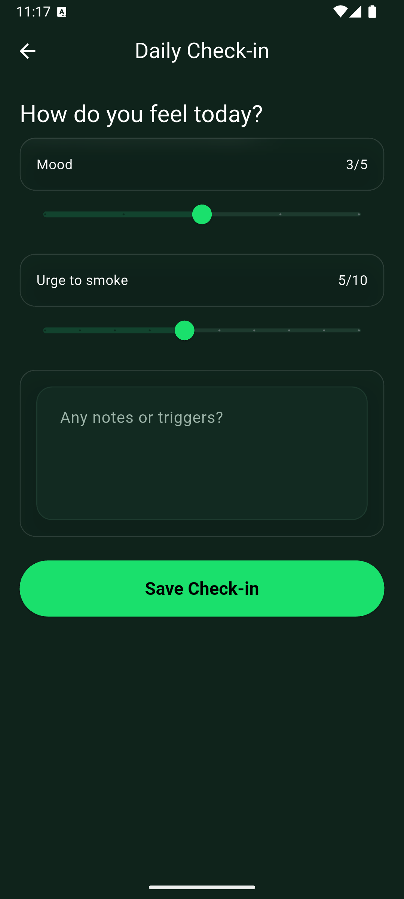

# No Nic – Quit‑smoking companion app (Flutter)

Nonic is a cross‑platform Flutter app that helps users quit smoking and stay smoke‑free. It combines daily check‑ins, craving logging, smart risk insights, milestone tracking, savings goals, and gentle notifications to support behavior change.

> Free to use: Nonic is free for anyone. No account required; all data stays on your device.

## Download

- APK (Android): [Download latest release](apk/app-release.apk)
  - Install by sideloading: transfer the APK to your device, then open it and allow installation from this source when prompted.

### What it does
- **Personal profile**: capture quit date, typical cigarettes/day, pack price, demographics
- **Daily check‑ins**: log mood and urge; one-per-day upserted storage
- **Cravings log**: record intensity, triggers, and strategies; view history
- **Slip logging**: track any cigarettes smoked after quitting for honest trends
- **Smart risk score**: 0–100 insight from last 7 days of urges/moods/cravings
- **Actionable tips**: context‑sized advice based on current risk
- **Health timeline**: motivational milestones from minutes → months after quit
- **Savings tracker**: money saved and cigarettes avoided since quit date
- **Notifications**: daily check‑in reminder and scheduled health milestone nudges
- **Beautiful UI**: custom glassmorphism theme with concise cards and metrics

### Architecture at a glance
- `lib/models.dart`: data models (`UserProfile`, `CravingEntry`, `SlipEntry`, `SavingsGoal`, `DailyCheckIn`)
- `lib/storage.dart`: persistence via `shared_preferences` (stringified JSON)
- `lib/utils.dart`: calculations (risk score, BMI, pack‑years), tips, notifications
- `lib/theme.dart`: dark theme + `Glass` UI helper
- `lib/pages/*`: screens (onboarding, dashboard, check‑in, cravings, goals, support, SOS breathing, etc.)
- `lib/main.dart`: app bootstrap, profile load, notification scheduling

## Setup

### Prerequisites
- Flutter SDK (Dart ^3.9, see `pubspec.yaml`)
- Platform toolchains as needed (Android Studio/Xcode, etc.)

### Install dependencies
```bash
flutter pub get
```

### Run
```bash
# choose a device (emulator or real)
flutter devices
flutter run
```

### Build
```bash
# Android (debug/release)
flutter build apk

# iOS (requires macOS/Xcode)
flutter build ios

# Web
flutter build web
```

### Privacy & permissions
- No Nic stores data locally on your device. No accounts, no cloud.
- Notification permission is requested to deliver gentle reminders and milestones.

## Configuration notes
- **Local notifications**: uses `flutter_local_notifications` and `timezone`.
  - App schedules a daily check‑in at 20:00 and future health‑timeline milestones based on `quitDate`.
  - Timezone is initialized with a conservative fallback to UTC when native info is unavailable.
- **Data storage**: persisted locally via `shared_preferences` using JSON strings; no backend required.
- **One check‑in per day**: `StorageService.upsertCheckIn` replaces the same‑day entry.

## Key UX flows
- **Onboarding** (`OnboardingScreen`): enter name, quit/start dates, consumption, pack price, age, gender, weight/height. Saves `UserProfile` and schedules notifications.
- **Dashboard** (`DashboardScreen`): shows days smoke‑free, avoided cigarettes, savings, next milestone countdown, today’s risk and tip, and quick actions (log craving, list cravings, daily check‑in, log slip).
- **SOS**: quick access to guided 4‑7‑8 breathing.

## Screenshots

<p>
  
  
  
  
</p>

<p>
  
  
  
</p>

## Tech stack
- Flutter + Material 3 (custom theme)
- Packages: `shared_preferences`, `intl`, `flutter_local_notifications`, `timezone`, `cupertino_icons`

## Project status
This is an early functional prototype suitable for local use and further iteration.

## Roadmap ideas
- Optional secure cloud sync
- Streak achievements and share cards
- More adaptive tips via analytics
- Widgets/Live Activities/Complications per platform

## License
MIT — free for personal and commercial use. See `LICENSE` (add one if missing).
